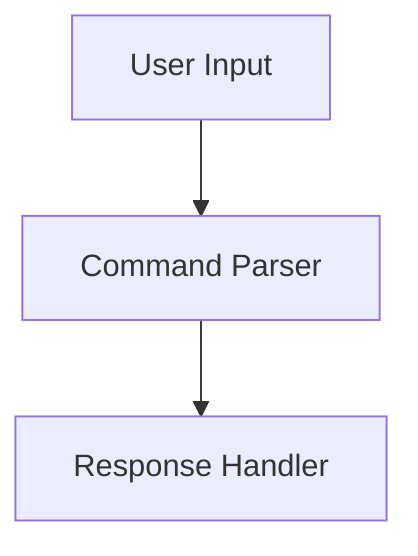
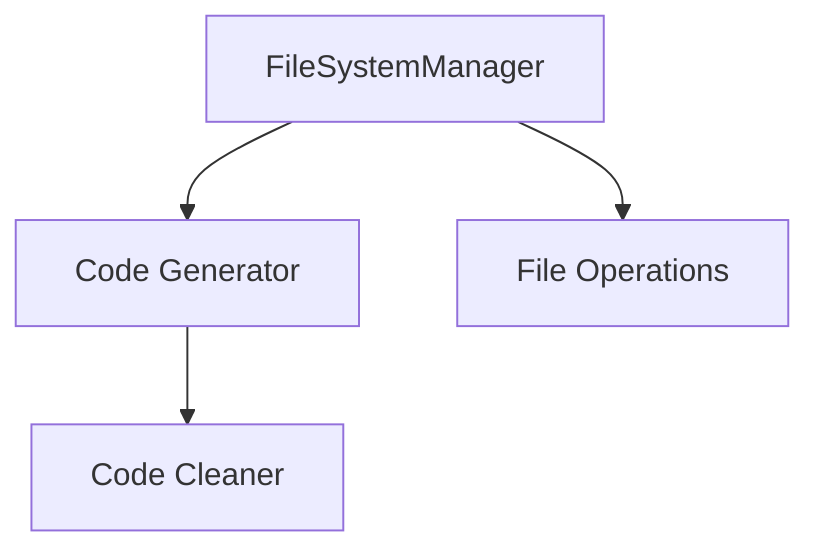
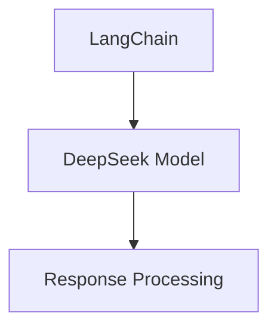

# OmnitrAIce Architecture Documentation

## System Overview

OmnitrAIce is built with a modular, layered architecture that separates concerns between user interaction, code generation, and file system operations.

## Core Components

### 1. User Interface Layer


The UI layer handles:
- Command line interface
- Input parsing
- Response formatting
- Error display
- Help system

### 2. Core System Layer


The core system manages:
- File operations
- Code generation
- Code cleaning
- Error handling
- State management

### 3. AI Integration Layer


The AI layer provides:
- Code generation
- Language understanding
- Context management
- Response optimization

## Data Flow

1. **Command Processing**
   ```
   User Input -> Command Parser -> FileSystemManager
   ```

2. **Code Generation**
   ```
   FileSystemManager -> AI Model -> Code Cleaner -> File System
   ```

3. **File Operations**
   ```
   FileSystemManager -> File System -> Response Handler
   ```

## System Interactions

### Command Processing Flow
1. User enters command
2. Command parser identifies operation type
3. FileSystemManager executes operation
4. Response handler formats result
5. User receives feedback

### Code Generation Flow
1. Parse code generation request
2. Generate code using AI model
3. Clean and format code
4. Save to file system
5. Return result to user

### File Operation Flow
1. Parse file operation request
2. Validate operation
3. Execute file system change
4. Handle errors if any
5. Return operation status