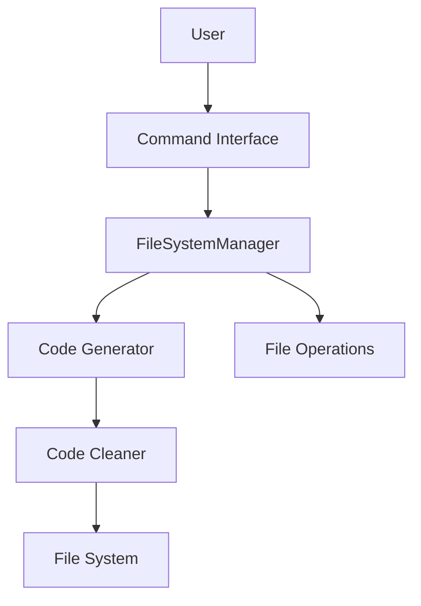

# OmnitrAIce Documentation

Welcome to the OmnitrAIce documentation. This comprehensive guide will help you understand and use the system effectively.

## Documentation Structure

### Core Documentation
- [Architecture Overview](architecture.md)
- [API Reference](api.md)
- [User Guide](user_guide.md)

### Diagrams
- System Architecture
- Code Generation Flow
- Component Interaction

### Additional Resources
- [Technical Documentation](../TECHNICAL.md)
- [README](../README.md)
- [Requirements](../requirements.txt)

## Quick Links

### For Users
- [Installation Guide](user_guide.md#installation)
- [Getting Started](user_guide.md#getting-started)
- [Basic Usage](user_guide.md#basic-usage)
- [Troubleshooting](user_guide.md#troubleshooting)

### For Developers
- [API Reference](api.md)
- [Architecture Details](architecture.md)
- [Development Guidelines](../TECHNICAL.md#development-guidelines)

## System Overview

OmnitrAIce is an AI-powered code generation and file management system that:
1. Generates clean, production-ready code
2. Supports multiple programming languages
3. Manages files and directories
4. Provides robust error handling

## Getting Help

- Use `help` command in the application
- Check the [User Guide](user_guide.md)
- Review [Troubleshooting](user_guide.md#troubleshooting)
- Create an issue on GitHub